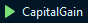

# Code Challenge NuBank

## Decisões técnicas

Ao ler e interpretar os requisitos do desafio, decidi utilizar C# como linguagem de programação. A escolha foi feita porque posso usufluir da Orientação a Objetos estruturando as `operações` e o `ganho de capital` em classes. Além disso, utilizei a biblioteca `System.Text.Json` para _deserializar_ o input e _serializar_ o retorno no console.

A lista de operações que é inputada na linha do console é descrita como a classe `Operation`. O conjunto de operações, onde será calculado as taxas em cima delas, é descrito na classe `CapitalGain`.

## Como compilar e executar

Para compilar e executar o projeto, é necessário instalar o `.NET v8.0` ou superior. As instruções para instalção seguem nos links abaixo:
* [.NET para Windows](https://learn.microsoft.com/pt-br/dotnet/core/install/windows)
* [.NET para MacOS](https://learn.microsoft.com/pt-br/dotnet/core/install/macos)
* [.NET para Linux](https://learn.microsoft.com/pt-br/dotnet/core/install/linux)

### Como compilar e executar o projeto no terminal:

1. Extraia a pasta `capital-gains.zip`.
2. Entre na pasta descompactada (`/capital-gains`).
3. Liste seu conteúdo para verificar se há a pasta `CapitalGain` e o arquivo `CapitalGain.sln`.
4. Verifique a instalação do .NET através do comando `dotnet --version`. A versão deve ser igual ou superior à versão 8.0.
5. Execute o comando `dotnet build`.
6. Execute o comando `dotnet run --project CapitalGain`.

### Como compilar e executar o projeto na IDE:

1. Extraia a pasta `capital-gains.zip`.
2. Abra a solução `CapitalGain.sln` no [Visual Studio 2022](https://visualstudio.microsoft.com/pt-br/thank-you-downloading-visual-studio/?sku=Community&channel=Release&version=VS2022) ou na sua IDE de preferência.
3. Execute a solução 


## Como testar a solução

Após executar o projeto, você pode inserir fazer o input dos testes abaixo. Lembre de teclar `Enter` para finalizar o input.

### Teste 1
Entrada:
```json
[{"operation":"buy", "unit-cost":10.00, "quantity": 100},{"operation":"sell", "unit-cost":15.00, "quantity": 50},{"operation":"sell", "unit-cost":15.00, "quantity": 50}]
[{"operation":"buy", "unit-cost":10.00, "quantity": 10000},{"operation":"sell", "unit-cost":20.00, "quantity": 5000},{"operation":"sell", "unit-cost":5.00, "quantity": 5000}]
```
Saída esperada:
```json
[{"tax": 0},{"tax": 0},{"tax": 0}]
[{"tax": 0},{"tax": 10000},{"tax": 0}]
```


### Teste 2
Entrada:
```json
[{"operation":"buy", "unit-cost":10.00, "quantity": 10000},{"operation":"sell", "unit-cost":5.00, "quantity": 5000},{"operation":"sell", "unit-cost":20.00, "quantity": 3000}]
```
Saída esperada:
```json
[{"tax": 0},{"tax": 0},{"tax": 1000}]
```


### Teste 3
Entrada:
```json
[{"operation":"buy", "unit-cost":10.00, "quantity": 10000},{"operation":"buy", "unit-cost":25.00, "quantity": 5000},{"operation":"sell", "unit-cost":15.00, "quantity": 10000}]
```
Saída esperada:
```json
[{"tax": 0},{"tax": 0},{"tax": 0}]
```


### Teste 4
Entrada:
```json
[{"operation":"buy", "unit-cost":10.00, "quantity": 10000},{"operation":"buy", "unit-cost":25.00, "quantity": 5000},{"operation":"sell", "unit-cost":15.00, "quantity": 10000},{"operation":"sell", "unit-cost":25.00, "quantity": 5000}]
```
Saída esperada:
```json
[{"tax": 0},{"tax": 0},{"tax": 0},{"tax": 10000}]
```


### Teste 5
Entrada:
```json
[{"operation":"buy", "unit-cost":10.00, "quantity": 10000},{"operation":"sell", "unit-cost":2.00, "quantity": 5000},{"operation":"sell", "unit-cost":20.00, "quantity": 2000},{"operation":"sell", "unit-cost":20.00, "quantity": 2000},{"operation":"sell", "unit-cost":25.00, "quantity": 1000}]
```
Saída esperada:
```json
[{"tax": 0},{"tax": 0},{"tax": 0},{"tax": 0},{"tax": 3000}]
```


### Teste 6
Entrada:
```json
[{"operation":"buy", "unit-cost":10.00, "quantity": 10000},{"operation":"sell", "unit-cost":2.00, "quantity": 5000},{"operation":"sell", "unit-cost":20.00, "quantity": 2000},{"operation":"sell", "unit-cost":20.00, "quantity": 2000},{"operation":"sell", "unit-cost":25.00, "quantity": 1000},{"operation":"buy", "unit-cost":20.00, "quantity": 10000},{"operation":"sell", "unit-cost":15.00, "quantity": 5000},{"operation":"sell", "unit-cost":30.00, "quantity": 4350},{"operation":"sell", "unit-cost":30.00, "quantity": 650}]
```
Saída esperada:
```json
[{"tax": 0}, {"tax": 0}, {"tax": 0}, {"tax": 0}, {"tax": 3000},
{"tax": 0}, {"tax": 0}, {"tax": 3700}, {"tax": 0}]
```


### Teste 6
Entrada:
```json
[{"operation":"buy", "unit-cost":10.00, "quantity": 10000},{"operation":"sell", "unit-cost":50.00, "quantity": 10000},{"operation":"buy", "unit-cost":20.00, "quantity": 10000},{"operation":"sell", "unit-cost":50.00, "quantity": 10000}]
```
Saída esperada:
```json
[{"tax": 0},{"tax": 80000},{"tax": 0},{"tax": 60000}]
``


### Teste 7
Entrada:
```json
[{"operation": "buy", "unit-cost": 5000.00, "quantity": 10},{"operation": "sell", "unit-cost": 4000.00, "quantity": 5},{"operation": "buy", "unit-cost": 15000.00, "quantity": 5},{"operation": "buy", "unit-cost": 4000.00, "quantity": 2},{"operation": "buy", "unit-cost": 23000.00, "quantity": 2},{"operation": "sell", "unit-cost": 20000.00, "quantity": 1},{"operation": "sell", "unit-cost": 12000.00, "quantity": 10},{"operation": "sell", "unit-cost": 15000.00, "quantity": 3}]
```
Saída esperada:
```json
[{"tax":0},{"tax":0},{"tax":0},{"tax":0},{"tax":0},{"tax":0},{"tax":1000},{"tax":2400}]
```
